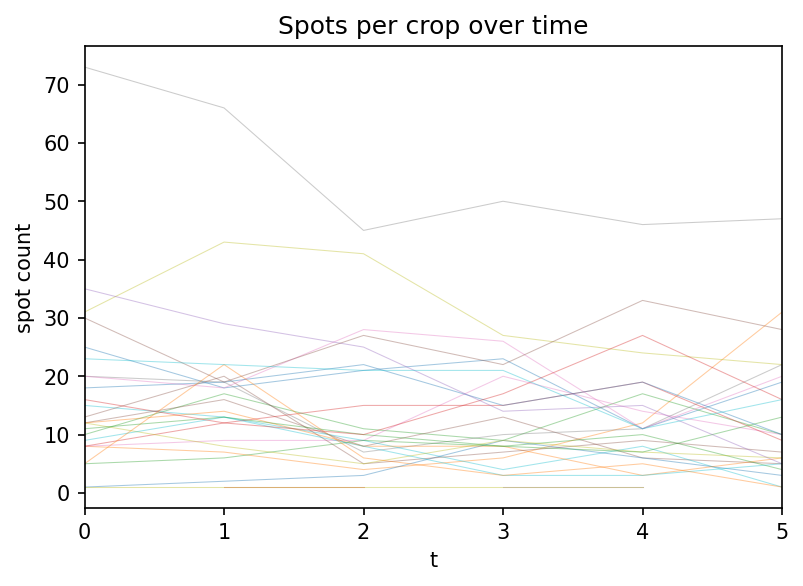

# mupattern

End-to-end pipeline for analyzing T-cell killing of cancer cells on micropatterns.

MCF7 cancer cells adhere to micropatterns printed on glass. CAR-T cells are added and kill cancer cells over time, causing them to detach. The pipeline classifies "cell present / absent" per micropattern crop per timepoint, then plots kill curves showing how many cells survive over time.

## App status

- `mupattern` (web) is a lite, deployed app and is currently maintenance-only.
- `mustudio` (desktop) is the primary surface for ongoing feature development, especially workspace flows.

### Positions

| Position | Condition | Description |
|----------|-----------|-------------|
| Pos140 | Control | MCF7 only, no T-cells |
| Pos150 | Killing 2D | MCF7 + CAR-T cells in suspension |
| Pos156 | Killing 3D | MCF7 + CAR-T cells in collagen gel |

## Pipeline overview

```
ND2 ──► muapplication file convert ──► raw TIFFs ──► /register ──► bbox CSV ──► muapplication file crop ──► crops.zarr
                                                        │
                                                        ▼
                                                      /see ──► annotation CSV
                                                        │
                                                        ▼
                                                muapplication kill dataset ──► HF Dataset
                                                        │
                                                        ▼
                                                  muapplication kill train ──► model weights
                                                        │
                                                        ▼
                                                muapplication kill predict ──► predictions CSV
                                                        │
                                                        ▼
                                                  muapplication kill clean ──► cleaned CSV
                                                        │
                                                        ▼
                                                   muapplication kill plot ──► kill curve plots

                                              muapplication expression analyze ──► expression CSV
                                                        │
                                                        ▼
                                                muapplication expression plot ──► expression plots

                                            muapplication tissue segment ──► masks.zarr
                                                        │
                                                        ▼
                                muapplication tissue analyze (crops + masks) ──► tissue CSV
                                                        │
                                                        ▼
                                                muapplication tissue plot ──► tissue plots

                                                  muapplication spot detect ──► spots CSV
                                                        │
                                                        ▼
                                                    muapplication spot plot ──► spot count plots
```

## Packages

| Package | Language | Description |
|---------|----------|-------------|
| `mupattern/` | React/Vite | Web app: simple landing page + pattern registration (Register) + crop viewer (See) |
| `mustudio/` | Electron + React/Vite | Desktop app: workspace dashboard + workspace-integrated Register/See experience |
| `muapplication/` | Python CLI (reference) | Pure CLI reference implementation; prod uses mustudio with compiled Rust binary + ONNX |

## Prerequisites

- [Bun](https://bun.sh/) for JavaScript/TypeScript packages
- [uv](https://docs.astral.sh/uv/) for Python packages
- Raw microscopy data: either an ND2 file (use `muapplication file convert` first) or 2048x2048 uint16 TIFFs named `img_channel{C}_position{N}_time{T}_z{Z}.tif` in `Pos{N}/` directories

## Step-by-step guide

### 1. Start the web app

```bash
cd mupattern
bun install
bun run dev
# open http://localhost:5173
```

The landing page (`/`) links to **Register** and **See**.

`mupattern` is intentionally kept minimal and stable; use `mustudio` for workspace-heavy workflows and new capabilities.

### 1a. Single-file mode (web)

If you only have one image, or want to work without a workspace:

1. Click **Register** on the landing page (or go to `/register`)
2. You'll see the register landing with options to **Load image** (single TIF/PNG) or **Start fresh** (blank canvas)
3. Register the pattern and export as usual

### Registration workflow (both modes)

Once an image is loaded in the registration tool:

1. **Set calibration**: pick the objective preset (10x, 20x, 40x) or type µm/pixel
2. **Configure lattice**: set parameters `a`, `b`, `alpha`, `beta`, and square size to match the micropattern geometry. Use "Square" or "Hex" presets if applicable
3. **Auto-detect** (optional): click "Detect cells" to find grid points (shown as green crosses), then click "Auto square (a=b)" or "Auto hex (a=b)" to fit the lattice. Works best on clear phase contrast images with regular spacing
4. **Align**: drag the pattern overlay to fine-tune — left-drag to pan, middle-drag to scale, right-drag to rotate
5. **Export**: click Export to download three files:
   - `*_bbox.csv` — bounding boxes for each pattern site (`crop,x,y,w,h`)
   - `*_config.yaml` — lattice parameters (for reloading later)
   - `*_mask.png` — binary mask image

The bbox CSV is the input for the cropping step.

### 1b. Workspace mode (desktop via mustudio)

Use `mustudio` when you want the folder-based multi-position workflow:

```bash
cd mustudio
bun install
bun run dev
```

From `mustudio`, use the workspace dashboard to open a folder, jump into Register, and navigate positions with prev/next.

### 2a. Convert ND2 to TIFF (muapplication file convert)

If your raw data is in Nikon ND2 format, convert it to per-position TIFF folders first:

```bash
uv run muapplication file convert /path/to/data.nd2 --pos all --time all --output /path/to/data
```

`--pos` and `--time` are required and accept `"all"` or a comma-separated mix of indices and Python-style slices:

```bash
# Convert only positions 0-2 and timepoints 0-49
uv run muapplication file convert /path/to/data.nd2 --pos "0:3" --time "0:50"

# Cherry-pick positions and timepoints
uv run muapplication file convert /path/to/data.nd2 --pos "0, 3, 5" --time "0:10, 50, -5:"

# Negative indices and steps work too
uv run muapplication file convert /path/to/data.nd2 --pos "-1" --time "0:100:2"
```

Before writing, the command prints the full list of selected positions and timepoints and asks for confirmation. TIFF filenames use contiguous 0-based time indices (so `crop` works unchanged); each `Pos{N}/` folder gets a `time_map.csv` mapping the TIFF time index back to the original ND2 timepoint.

### 2b. Crop into zarr (muapplication file crop)

Cut each pattern site out of every frame and store as a zarr array.

```bash
uv run muapplication file crop \
  --input /path/to/data \
  --pos 150 \
  --bbox /path/to/bbox.csv \
  --output /path/to/crops.zarr \
  --no-background
```

- `--input` is the **parent** directory containing `Pos{N}/` subdirectories
- `--pos` is the position number (e.g. `150` reads from `Pos150/`)
- `--bbox` is the CSV exported by the registration tool (`/register`)
- `--output` is the zarr store path (created if it doesn't exist, appended if it does)
- `--background` / `--no-background` — whether to compute per-frame background (median of pixels outside all crop bounding boxes), stored in the zarr store

Output layout:

```
crops.zarr/
  pos/
    150/
      crop/
        000/    # shape (T, C, Z, H, W) — e.g. (145, 1, 1, 77, 77)
        001/
        ...
```

Each crop is a TCZYX zarr array with chunk size `(1,1,1,H,W)` for fast single-frame reads.

### 3. Annotate in See

Open the crop viewer to label cells as present or absent. See is available at `/see` within the mupattern app.

1. From the landing page, click **See** (or navigate to `/see`)
2. **Open folder**: click "Open crops.zarr" and select the `crops.zarr` directory using the browser's folder picker
3. **Browse**: use the time slider and transport controls (`|<`, `<<`, `<`, play, `>`, `>>`, `>|`) to scrub through timepoints. The 5x5 grid shows crops with auto-contrast
4. **Annotate**: click the "Annotate" toggle, then click crops to cycle through states:
   - **No ring** → **Blue ring** (present) → **Red ring** (absent) → **No ring**
   - **Green ring** appears on crops annotated at other timepoints but not the current one (helps you find gaps)
5. **Navigate pages**: use page controls below the grid to see all crops
6. **Save**: click "Save CSV" to download `annotations.csv` with format `t,crop,label`

Tips:
- Start at `t=0` and annotate a representative subset of crops (e.g. 20–30 crops)
- For each crop, annotate several timepoints covering the transition from present to absent
- You need at least ~400 labeled samples for decent training. In our case, 28 crops × 15 timepoints = 420 labels

### 4. Build training dataset (muapplication kill dataset)

Convert the zarr crops + annotation CSV into a HuggingFace Dataset.

Create a config YAML:

```yaml
# dataset.yaml
sources:
  - zarr: /path/to/crops.zarr
    pos: 150
    annotations: /path/to/annotations.csv
```

Run:

```bash
uv run muapplication kill dataset \
  --config /path/to/dataset.yaml \
  --output /path/to/dataset
```

This reads every annotated `(t, crop)` pair from the zarr store, normalizes uint16 → uint8, and saves as a HuggingFace Dataset with columns: `image`, `label` (0=absent, 1=present), `pos`, `crop`, `t`.

### 5. Train the classifier (muapplication kill train)

Fine-tune a pretrained ResNet-18 on your dataset.

```bash
uv run muapplication kill train \
  --dataset /path/to/dataset \
  --output /path/to/model \
  --epochs 20 \
  --batch-size 32 \
  --lr 1e-4
```

The best checkpoint (by F1 score) is saved to `model/best/`. Training takes ~45 seconds on Apple Silicon with 420 samples. Our model achieved 96.5% accuracy and 0.97 F1.

Our pretrained model is available on HuggingFace: [keejkrej/mupattern-resnet18](https://huggingface.co/keejkrej/mupattern-resnet18)

Options:
- `--epochs` — number of training epochs (default: 20)
- `--batch-size` — training batch size (default: 32)
- `--lr` — learning rate (default: 1e-4)
- `--split` — validation fraction (default: 0.2)

### 6. Predict on all crops (muapplication kill predict)

Run inference on the full zarr store (or a subset).

Create a predict config YAML:

```yaml
# predict.yaml
sources:
  - zarr: /path/to/crops.zarr
    pos: 150
    t_range: [0, 50]       # optional: only predict t=0..49
    crop_range: [0, 125]   # optional: only predict crops 0..124
```

Run:

```bash
# Using the pretrained model from HuggingFace:
uv run muapplication kill predict \
  --config /path/to/predict.yaml \
  --model keejkrej/mupattern-resnet18 \
  --output /path/to/predictions.csv

# Or using a local model directory:
uv run muapplication kill predict \
  --config /path/to/predict.yaml \
  --model /path/to/model/best \
  --output /path/to/predictions.csv
```

Output is a CSV in the same `t,crop,label` format as annotations — can be loaded back into See for visual verification.

### 7. Clean and plot (muapplication kill)

The raw predictions may have "flickering" — a cell classified as absent then present again. Since dead cells can't come back, enforce monotonicity:

```bash
# Clean: once absent, stays absent
uv run muapplication kill clean \
  --input /path/to/predictions.csv \
  --output /path/to/cleaned.csv

# Plot: kill curve + death time histogram
uv run muapplication kill plot \
  --input /path/to/cleaned.csv \
  --output /path/to/kill_curve.png
```

The `clean` command reports which crops had violations (resurrections) and forces all timepoints after the first absence to absent.

The `plot` command generates two panels:
- **Kill curve**: number of present cells over time
- **Death time histogram**: when cells died (first timepoint classified absent)

Death times at `t=0` are excluded — a crop absent at `t=0` means no cell was ever present on that pattern site, not a death event.

### 8. Tissue — multi-cell crops (muapplication tissue)

For crops with multiple cells per pattern (e.g. ~10 cells, phase + fluorescence), segment with Cellpose v4 and measure per-cell GFP expression.

```bash
# Segment: run Cellpose on each crop/frame, save masks (same layout as crops)
uv run muapplication tissue segment \
  --zarr /path/to/crops.zarr \
  --pos 0 \
  --channel-phase 0 \
  --channel-fluorescence 1 \
  --output /path/to/masks.zarr

# Analyze: load crops + masks, compute per-cell total fluorescence, area, background
uv run muapplication tissue analyze \
  --zarr /path/to/crops.zarr \
  --masks /path/to/masks.zarr \
  --pos 0 \
  --channel-fluorescence 1 \
  --output /path/to/tissue.csv

# Plot: GFP+ count and mean/median intensity above background over time
uv run muapplication tissue plot \
  --input /path/to/tissue.csv \
  --output /path/to/tissue.png \
  --gfp-threshold 1.0
```

- **segment** uses phase + fluorescence to build a 3-channel image for Cellpose (SAM backbone). Output `masks.zarr` mirrors `crops.zarr`: `pos/{pos}/crop/{crop_id}` with shape `(T, H, W)` uint32 labels.
- **analyze** reads fluorescence from crops and labels from masks; writes CSV with `t,crop,cell,total_fluorescence,cell_area,background`. If `pos/{pos}/background` is missing in crops.zarr, background is 0.
- **plot** treats a cell as GFP+ when `(total_fluorescence / cell_area) - background > --gfp-threshold`, then plots GFP+ count and mean/median of that value over time.

### 9. Detect spots (muapplication spot)

Detect fluorescent spots per crop per timepoint using spotiflow.

Create a config YAML:

```yaml
# spots.yaml
sources:
  - zarr: /path/to/crops.zarr
    pos: 0
    channel: 1
```

Run:

```bash
# Detect spots
uv run muapplication spot detect \
  --config /path/to/spots.yaml \
  --output /path/to/spots.csv

# Use a different spotiflow model
uv run muapplication spot detect \
  --config /path/to/spots.yaml \
  --output /path/to/spots.csv \
  --model general

# Plot spot counts over time
uv run muapplication spot plot \
  --input /path/to/spots.csv \
  --output /path/to/spots.png
```

## Results

### Pos150 — Killing 2D (MCF7 + CAR-T in suspension)


- 125 crops analyzed over 50 timepoints
- 72 empty at `t=0` (no cell present)
- 32 cells killed by T-cells
- 0 survived (within the 50-timepoint window)
- 70/125 crops had monotonicity violations (187 resurrection events) before cleaning

### Pos156 — Killing 3D (MCF7 + CAR-T in collagen gel)


- 125 crops analyzed over 50 timepoints
- 72 empty at `t=0`
- 32 cells killed
- 21 survived
- 48/125 crops had monotonicity violations (1138 resurrection events) before cleaning — much noisier than 2D, likely due to collagen gel obscuring cells

### Pos140 — Control (MCF7 only, no T-cells)


- 125 crops analyzed over 50 timepoints
- 72 empty at `t=0`
- 6 false deaths (model errors — no T-cells were added)
- 47 survived all 50 timepoints
- False positive death rate: ~11% (6/53 cells that were actually present)

### Spot detection — Pos9



- 36 crops (6×6 grid, 154×154 px), 163 timepoints, channel 2 (fluorescence)
- 24,547 spots detected across all 36 crops
- Several crops show a transient burst peaking at t≈30 (60–80 spots), decaying by t≈60
- Lower-expressing crops remain flat at 5–15 spots throughout

### Expression — HuH7 Pos0


- 145 crops, 180 timepoints, channel 1 (fluorescence)
- Left: raw summed intensity per crop; Right: background-subtracted

### Expression — HuH7 Pos1


- 169 crops, 180 timepoints, channel 1 (fluorescence)
- Left: raw summed intensity per crop; Right: background-subtracted

## Data files

```
examples/
  kill_pos140_bbox.csv              # Pos140 bounding boxes (control — MCF7 only)
  kill_pos150_bbox.csv              # Pos150 bounding boxes (killing 2D — MCF7 + CAR-T in suspension)
  kill_pos156_bbox.csv              # Pos156 bounding boxes (killing 3D — MCF7 + CAR-T in collagen gel)
  kill_pos150_annotation.csv        # manual annotations (420 labels, 28 crops, t=0..21)
  kill_pos140_config.yaml           # muapplication kill predict config for Pos140
  kill_pos150_config.yaml           # muapplication kill predict config for Pos150
  kill_pos156_config.yaml           # muapplication kill predict config for Pos156
  kill_pos140.png                   # kill curve — control
  kill_pos150.png                   # kill curve — killing 2D
  kill_pos156.png                   # kill curve — killing 3D
  spot_pos9_bbox.csv                # Pos9 bounding boxes (spot detection)
  spot_pos9_config.yaml             # muapplication spot detect config for Pos9 (channel 2)
  spot_pos9.png                     # spot count curves — Pos9
  expression_pos0_bbox.csv          # Pos0 bounding boxes (HuH7)
  expression_pos1_bbox.csv          # Pos1 bounding boxes (HuH7)
  expression_pos0_config.yaml       # muapplication expression analyze config for Pos0
  expression_pos1_config.yaml       # muapplication expression analyze config for Pos1
  expression_pos0.jpg               # expression curves — Pos0
  expression_pos1.jpg               # expression curves — Pos1
```

Model weights are hosted on HuggingFace: [keejkrej/mupattern-resnet18](https://huggingface.co/keejkrej/mupattern-resnet18)

To download:

```bash
uvx --from huggingface_hub hf download keejkrej/mupattern-resnet18 --local-dir ./model/best
```

## File formats

### Bounding box CSV (Register → muapplication file crop)

```csv
crop,x,y,w,h
0,28,1878,77,77
1,22,1678,77,77
```

### Annotation / prediction CSV (See ↔ muapplication kill)

```csv
t,crop,label
0,000,true
0,001,false
1,000,true
```

All tools use the same `t,crop,label` format. Labels are `true` (cell present) or `false` (cell absent).

### Dataset config YAML (muapplication kill dataset)

```yaml
sources:
  - zarr: /path/to/crops.zarr
    pos: 150
    annotations: /path/to/annotations.csv
```

### Expression CSV (muapplication expression analyze → muapplication expression plot)

```csv
t,crop,intensity,area,background
0,000,12345,5929,2.1
0,001,9876,5929,2.1
1,000,12400,5929,2.0
```

One row per crop per timepoint. `intensity` is the sum of pixel values in the crop; `area` is the number of pixels (h×w); `background` is the per-pixel background for that frame/channel (from `crops.zarr`). Background-subtracted intensity = `intensity - background * area`.

### Tissue CSV (muapplication tissue analyze → muapplication tissue plot)

```csv
t,crop,cell,total_fluorescence,cell_area,background
0,000,1,1234.5,892,2.1
0,000,2,987.2,756,2.1
0,001,1,456.7,623,2.1
1,000,1,1450.2,895,2.0
```

One row per cell per frame. `cell` is the segmentation label (1, 2, …); `total_fluorescence` is the sum of fluorescence in that cell’s pixels; `cell_area` is the number of pixels in the cell; `background` is per-pixel background for that frame/channel (0 if missing from crops.zarr). GFP+ in plot: `(total_fluorescence / cell_area) - background > --gfp-threshold`.

### Spot CSV (muapplication spot detect → muapplication spot plot)

```csv
t,crop,spot,y,x
0,000,0,12.34,56.78
0,000,1,23.45,67.89
1,000,0,11.22,55.66
```

One row per detected spot. `spot` is a 0-based index within each `(t, crop)` frame. `y` and `x` are subpixel spot coordinates.

### Predict config YAML (muapplication kill predict)

```yaml
sources:
  - zarr: /path/to/crops.zarr
    pos: 150
    t_range: [0, 50]       # [start, end), optional
    crop_range: [0, 125]   # [start, end), optional
```

## Development

```bash
# Install JS dependencies and run the web app
cd mupattern
bun install
bun run dev

# Desktop workspace app
cd ../mustudio
bun install
bun run dev

# Run Python CLIs from repo root (uv workspace)
uv run muapplication --help
uv run muapplication file --help
uv run muapplication kill --help
uv run muapplication expression --help
uv run muapplication tissue --help
uv run muapplication spot --help
```

## Tech stack

- **mupattern** (web register + see): React 18, TypeScript, Vite, React Router, TanStack Store, Tailwind CSS 4, shadcn/ui, HTML5 Canvas, File System Access API
- **mustudio** (desktop workspace): Electron, React 18, TypeScript, Vite, React Router, TanStack Store
- **muapplication** (CLI reference): Python, typer, zarr v2, tifffile, nd2, transformers, torch, cellpose, spotiflow, pandas, matplotlib

